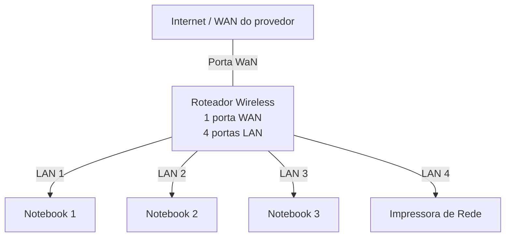
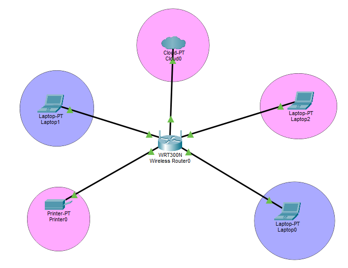

# Laboratório de Redes- Projeto de Rede Local

Projeto desenvolvido na Disciplina de Redes de Computadores no Curso Técnico de infomática do Senac

Aluno: Yasmin

Professor: José De Assis

Data: 09/03/2026

---
## 1.Objetivo
Implementar uma rede local simples conectando 3 notebook e um roteador com swich intergrado a uma impressora de rede.

## O projeto será realizado em duas etapas 
1.Simulação de rede Cisco Packet Tracer
2.Implementação de rede no laboratório real

---

## 2.Equipamentos utilizados neste laboratório

 - 3 notebooks
 - 1 roteador wireless com 1 porta WAN e 4 portas LAN
 - 1 impressora de rede
 - cabos de redes

---
# 3. Topologia de Rede
Diagram Lógica de rede utilizada nesta laboratório

---

## 4.Plano de endereço IP

REDE:192.168.0.0/24
Gateway:192.168.0.1

|Dispositivos | Tipos de IP | Enderenço IP | Observação |
|--------------|-------------|--------------|------------|
| Roteador| Estácio | 192.168.0.1 | IP roteador |
| Impressora | Reserva DHCP | 192.168.0.100| IP reservado pelon roteador|
| PC1 | Reserva DHCP | 192.168.0.101| IP reservado pelon roteador|
| PC2 | DHCP | Automático | IP atribuido pelo roteador |
| PC3 | DHCP | Automático | IP atribuido pelo roteador |

## Observação ##

-A impressora e um dos notebook utilizados reserva DHCP
-O roteador sempre atribui o mesmo Ip a esses dispositivos

---
## 5.Implementação no laboratório Real

Após a instalação, a rede foi montada fisicamente no laboratório

Etapas realizadas:

(Fotos)

Testes:

(Fotos)

---

## 6.Conclusão

Este laboratório permitiu compreender o funcionamento de uma rede local simples, incluindo:

 - Estrutura de uma rede doméstica ou de pequeno escritório
 
 - Utilização de um roteador com porta WAN e portas LAN
 
 - Funcionamento do DHCP
 
 - Comunicação entre dispositivos na rede local
 
 - Utilização de uma impressora de rede
 
 - Compartilhamento de pastas na rede
